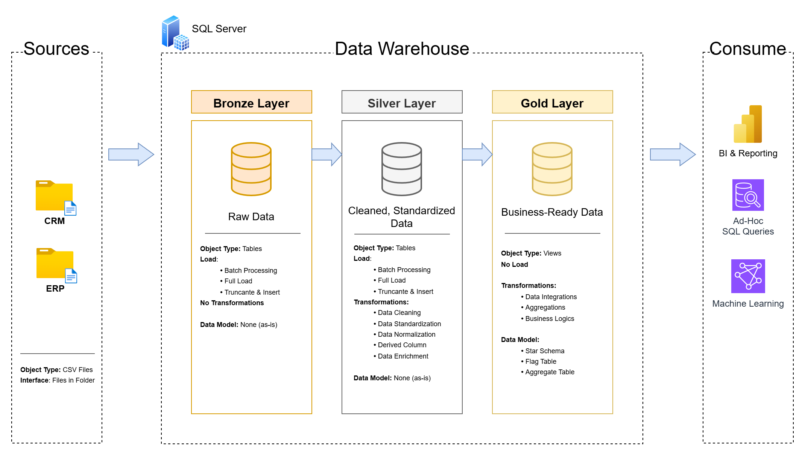
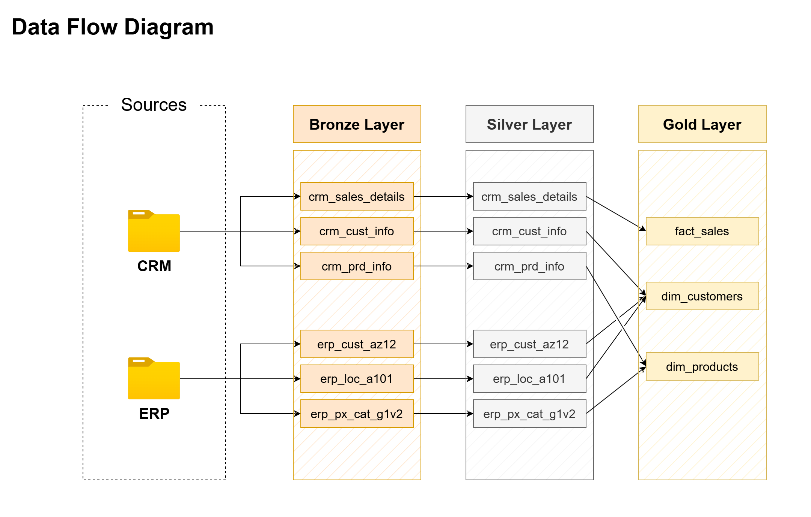
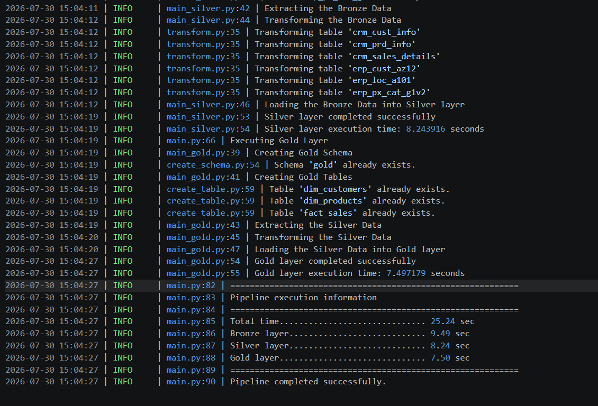

# ETL Python Pipeline Project


[](./LICENSE)

## 📑 Table of Contents

- [Project Relationship](#-project-relationship)
- [Overview](#-overview)
- [Features](#-features)
- [Project Requirements](#-project-requirements)
- [Technologies](#-technologies)
- [Repository Structure](#-repository-structure)
- [Project Architecture](#-project-architecture)
- [ETL Flow](#-etl-flow)
- [Logging](#-logging)
- [Documentation](#-documentation)
- [How to Run](#-how-to-run)
- [Future Improvements](#-future-improvements)
- [License](#license)
- [About Me](#-about-me)

---

## 🔗 Project Relationship

This repository is the second part of a larger Data Engineering project.

The first project, **SQL Data Warehouse Project**, focuses on designing and implementing the data warehouse using Microsoft SQL Server, including the Medallion Architecture, data modeling, and SQL transformations.

This repository builds upon that foundation by implementing a complete **ETL pipeline in Python**, responsible for extracting, transforming, and loading data into the data warehouse.

➡️ **Previous Project:**  
[SQL Data Warehouse Project](https://github.com/Rodrigo3441/sql-data-warehouse-project)

## 📑 Overview

This project implements a complete **ETL (Extract, Transform, Load) pipeline** in Python, following the **Medallion Architecture** (Bronze, Silver, and Gold layers). It demonstrates how raw data from multiple CRM and ERP CSV sources can be extracted, transformed, and loaded into a Microsoft SQL Server data warehouse through a modular and scalable pipeline.

The pipeline is designed with a layered architecture, where each stage has a specific responsibility. The Bronze layer ingests raw source data into the database, the Silver layer performs data cleansing and transformations to improve data quality, and the Gold layer creates business-ready dimensional models for analytical reporting.

To promote maintainability and code organization, the project is divided into independent modules responsible for schema creation, table creation, data extraction, transformation, and loading. Layer orchestration is handled by dedicated pipeline controllers, while centralized logging and exception handling provide execution monitoring and simplify troubleshooting.

This project serves as a practical implementation of Data Engineering concepts using Python, pandas, SQLAlchemy, and Microsoft SQL Server, demonstrating software engineering best practices such as modular design, reusable components, structured logging, execution time monitoring, and comprehensive documentation.

---

## ⭐ Features

- Modular ETL architecture<br>
- Bronze, Silver and Gold layers<br>
- SQL Server integration<br>
- pandas transformations<br>
- SQLAlchemy<br>
- Centralized logging<br>
- Execution time monitoring<br>
- Exception handling<br>
- Modular project structure<br>

---

## ✔ Project Requirements

### Objective

Develop a modular and scalable **ETL (Extract, Transform, Load) pipeline** in Python to automate the population of a SQL Server data warehouse following the **Medallion Architecture** (Bronze, Silver, and Gold layers). The pipeline should extract data from multiple source systems, perform data cleansing and transformations, and load the processed data into the appropriate data warehouse layers while providing execution monitoring through centralized logging.

---

### Specifications

* **Data Sources:** Extract data from CRM and ERP source systems provided as CSV files.
* **Data Extraction:** Read source files using pandas and organize the extracted data for processing.
* **Data Transformation:** Cleanse, standardize, and transform the data according to the business rules defined for each Medallion layer.
* **Data Loading:** Load the processed data into Microsoft SQL Server using SQLAlchemy, preserving the Bronze, Silver, and Gold architecture.
* **Pipeline Architecture:** Implement a modular ETL pipeline with independent components for schema creation, table creation, extraction, transformation, loading, and orchestration.
* **Logging & Monitoring:** Record pipeline execution, processing steps, execution times, and errors using Python's logging module.
* **Error Handling:** Implement exception handling to ensure failures are reported with sufficient detail for troubleshooting.
* **Documentation:** Provide clear documentation of the project architecture, ETL workflow, repository structure, and execution process.

---

## ⚙ Technologies

| Category                     | Technologies                    |
| ---------------------------- | ------------------------------- |
| **Programming Language**     | Python                          |
| **Data Processing and Transformations**     | `pandas`          |
| **Database Connectivity**    | `SQLAlchemy`                    |
| **Database Driver**          | pyodbc
| **Logging**                  | Python `logging`                |
| **Database**                 | Microsoft SQL Server            |
| **Development Tools**        | Visual Studio Code              |
| **Documentation & Diagrams** | Draw.io                         |
| **Version Control**          | Git, GitHub                     |

## 🏗 Repository Structure
```text
etl-pipeline-project/
├── database/
│   └── connection.py              # Creates and manages the SQL Server database connection.
│
├── datasets/
│   ├── source_crm/                # CRM source datasets (CSV files).
│   └── source_erp/                # ERP source datasets (CSV files).
│
├── docs/                          # Project documentation, diagrams, and supporting assets.
│
├── scripts/
│   ├── bronze/
│   │   ├── define_tables.py       # Defines the Bronze layer database tables.
│   │   ├── extract.py             # Extracts raw data from the source CSV files.
│   │   └── main_bronze.py         # Orchestrates the Bronze layer ETL process.
│   │
│   ├── gold/
│   │   ├── transformations/
│   │   │   ├── dim_customers.py   # Builds the Customer dimension.
│   │   │   ├── dim_products.py    # Builds the Product dimension.
│   │   │   └── fact_sales.py      # Builds the Sales fact table.
│   │   │
│   │   ├── define_tables.py       # Defines the Gold layer database tables.
│   │   ├── main_gold.py           # Orchestrates the Gold layer ETL process.
│   │   └── transform.py           # Executes Gold layer transformations.
│   │
│   ├── silver/
│   │   ├── transformations/
│   │   │   ├── crm_cust_info.py   # Cleans and transforms CRM customer data.
│   │   │   ├── crm_prd_info.py    # Cleans and transforms CRM product data.
│   │   │   ├── crm_sales_details.py # Cleans and transforms CRM sales data.
│   │   │   ├── erp_cust_az12.py   # Cleans and transforms ERP customer data.
│   │   │   ├── erp_loc_a101.py    # Cleans and transforms ERP location data.
│   │   │   └── erp_px_cat_g1v2.py # Cleans and transforms ERP product category data.
│   │   │
│   │   ├── define_tables.py       # Defines the Silver layer database tables.
│   │   ├── extract.py             # Extracts data from the Bronze layer.
│   │   ├── main_silver.py         # Orchestrates the Silver layer ETL process.
│   │   └── transform.py           # Executes Silver layer transformations.
│   │
│   ├── create_schema.py           # Creates database schemas if they do not exist.
│   ├── create_table.py            # Creates database tables dynamically.
│   └── load.py                    # Loads processed data into SQL Server.
│
├── .gitignore                     # Files and directories excluded from version control.
├── main.py                        # Entry point of the ETL pipeline.
├── pipeline.log                   # Execution logs generated during pipeline runs.
└── README.md                      # Project documentation.
```


## 🛠 Project Architecture



The ETL pipeline loads data into a SQL Server data warehouse following the Medallion Architecture, where each layer has a specific responsibility in the data processing workflow.

---

## 💿 ETL Flow



As data moves through the Medallion Architecture, each layer applies a specific set of transformations to progressively improve data quality and prepare it for analytical workloads.

### RAW -> Bronze

The Bronze layer is responsible for ingesting the raw source data into SQL Server with minimal modifications. At this stage, the original data is preserved to maintain an accurate representation of the source systems.

### Bronze -> Silver

The Silver layer focuses on improving data quality by applying cleansing, standardization, validation, and enrichment transformations. These processes ensure that the data is consistent, reliable, and suitable for downstream analytical workloads.

Some of the transformations that were applied to the data:

| Table               | Applied Transformations                                                 |
|---------------------|-------------------------------------------------------------------------|
| **crm_cust_info**       | Filtering, deduplication, text standardization, code mapping            |
| **crm_prd_info**        | Derived columns, null handling, code mapping, temporal (LEAD-like) logic|
| **crm_sales_details**   | Data quality validation and recalculation of business metrics           |
| **erp_cust_az12**       | Identifier normalization, date validation, categorical standardization  |
| **erp_loc_a101**        | String cleaning and country normalization                               |
| **erp_px_cat_g1v2**     | Schema standardization only (no business transformations)               |


### Silver -> Gold

The Gold layer transforms the curated Silver data into dimensional models optimized for business intelligence, reporting, and analytical queries.

Some of the transformations that were applied to the data:

| Table             | Applied Transformations |
|-------------------|-------------------------|
| **dim_customers** | Data aggregations between `crm_cust_info`, `erp_cust_az12` and `erp_loc_a101`, data enhancement, and surrogate key creation for data aggregations |
| **dim_products**  | Data aggregations between `crm_prd_info` and `erp_px_cat_g1v2`, historical data deletion, and surrogate key creation for data aggregations
| **fact_sales**    | Data aggregations between `crm_sales_details` and the two previous dimensions (`dim_customers` and `dim_products`)

At this stage, the Gold layer provides business-ready datasets that can be consumed by BI dashboards, ad-hoc SQL queries, machine learning workflows, and other analytical applications.

---

## 🧾 Logging

The ETL pipeline implements centralized logging to monitor the execution of each processing stage and simplify troubleshooting. All pipeline events are recorded in the pipeline.log file using Python's built-in logging module.

The logging system provides information about:

- Pipeline start and completion.
- Execution of the Bronze, Silver, and Gold layer orchestrators.
- Schema and table creation.
- Data extraction, transformation, and loading operations.
- Execution time for each Medallion layer.
- Total pipeline execution time.
- Exceptions and error reporting with detailed stack traces.

### Example Log Output



Each log entry includes:

| Field         | Description                                                |
| ------------- | ---------------------------------------------------------- |
| **Timestamp** | Date and time when the event occurred.                     |
| **Log Level** | Severity of the event (e.g., `INFO`, `ERROR`).             |
| **Source**    | Python file and line number where the event was generated. |
| **Message**   | Description of the executed operation or error.            |

---

## 📚 Documentation

This repository includes detailed documentation covering the system design, database structure, and development decisions.

Available documentation:

- **Data Architecture**<br>
    Overview of the system layers, medallion architecture, and application structure.
    - [Data Architecture](docs/data_architecture/data_architecture.png)

- **ETL Flow**<br>
    Illustrates the ETL workflow, the source systems, and how the data moves from each layer
    - [ETL Flow](docs/data_flow/data_flow.png)

- **Data Catalog for Gold Layer**
    documents the structure of the Gold layer of the data warehouse
    - [Data Catalog](docs/data_catalog.md)

- **Naming Conventions**
    Defines standards and patterns for naming throughout the project
    - [Naming Conventions](docs/naming_conventions.md)


## 💾 How to Run

Follow the steps below to execute the ETL pipeline.

### 1. Clone the Repository

``` bash
git clone https://github.com/Rodrigo3441/etl-pipeline-project.git
cd etl-pipeline-project
```

### 2. Install the Required Packages

``` bash
pip install -r requirements.txt
```

### 3. Configure the Database Connection

Open the `database/connection.py` file and update the SQL Server connection parameters (Windows Trusted Connection):

- Server name
- Database name
- ODBC Driver

### 4. Prepare the Source Data

Make sure the CRM and ERP CSV files are inside the following directories:

``` bash
datasets/
├── source_crm/
└── source_erp/
```

### 5. Execute the Pipeline

Run the main script:

``` bash
python main.py
```
### 6. Verify the Results

After the execution completes:

- The Bronze, Silver, and Gold schemas will be created (if they do not already exist).
- The source data will be processed and loaded into SQL Server.
- Execution details will be recorded in the pipeline.log file.

---

## 🆕 Future Improvements

The following enhancements could be implemented in future versions of the pipeline:

- Incremental Data Loading<br>
- Configuration File Support
- Containerization
- Workflow Orchestration
- Data Quality Validation
- Automated Testing
- Cloud Deployment
- CI/CD Integration
- Pipeline Monitoring
- Support for Additional Data Sources
---

## License

This project is licensed under the [MIT License](LICENSE). You are free to use, modify, and share this project with proper attribution.

---
## 👨‍💻 About Me

Hi! I'm Rodrigo, a Computer Science student passionate about Data Engineering. I enjoy building data pipelines, designing data warehouses, and continuously learning new technologies related to data engineering and software development.